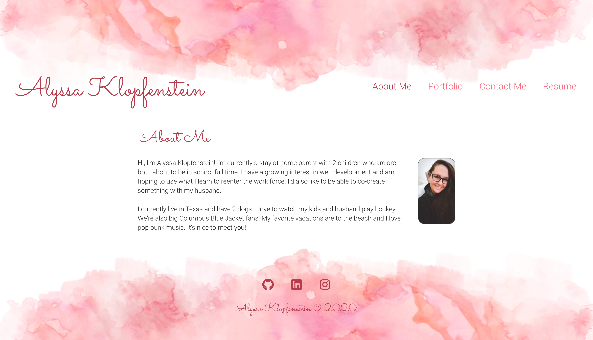

# React Portfolio

## Purpose
This react portfolio is a single page application for potential employers to see a candidate's body of work, social media profiles and a way to contact the candidate; so employers can gauge a candidate's fit for the position.

## Screenshot

## Links
[GitHub Repo](https://github.com/apklopfenstein/react-portfolio) 
[Deployed App](http://apklopfenstein.github.io/react-portfolio)